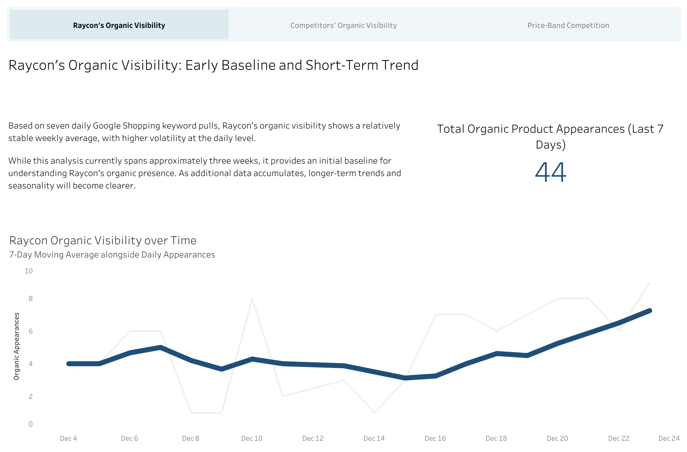
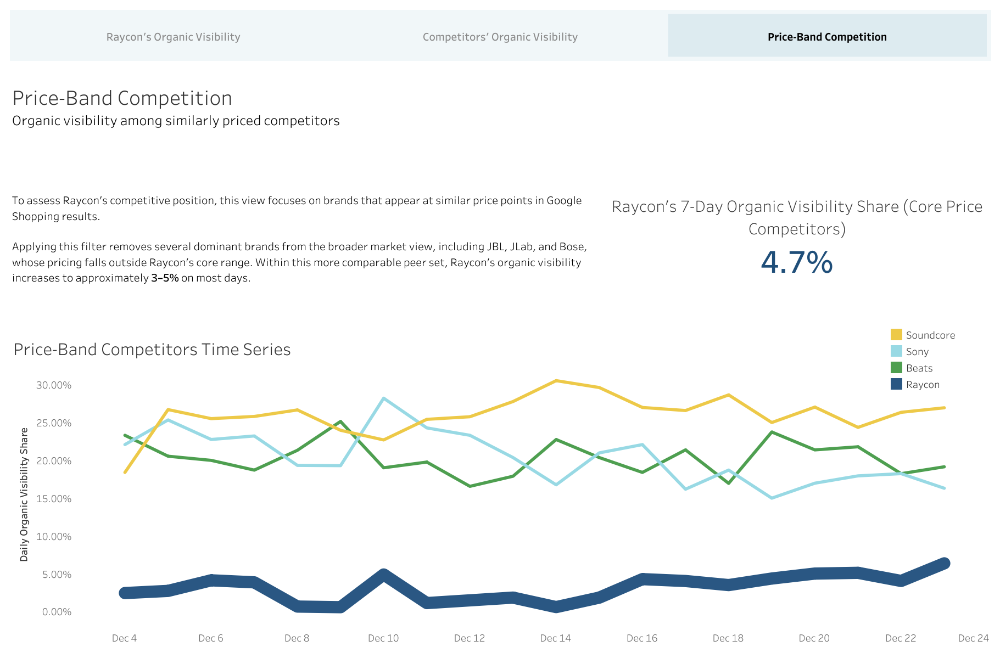

# Raycon Competitive Intelligence: Google Shopping Visibility & Pricing Analytics

Tableau Dashboard Suite:
https://public.tableau.com/app/profile/thomas.howell2255/viz/RayconCompetitiveIntelligence-GoogleShoppingOrganicVisibility/RayconsOrganicVisibility
<br> <br>



## 1. Project Scope

**Client Scenario:**
This project is framed as a consulting-style case study focused on Raycon, a direct-to-consumer audio brand. It is not affiliated with or endorsed by Raycon.

**Business Problem:**
Raycon competes in crowded, high-intent keyword categories such as wireless earbuds, noise-cancelling earbuds, and budget headphones. Improving Google Shopping visibility is strategically important.
Raycon lacks clear visibility into:
- How often its products appear in Google Shopping search results
- Its visibility relative to its competitors
- Whether visibility is improving or declining over time

**Objectives:**
- Pull daily Google Shopping results for high-intent audio keywords
- Store, preserve, and transform raw API payloads
- Generate organic visibility metrics
- Communicate insights through a Tableau dashboard suite

**Business Value:**
By understanding visibility patterns and competitor dominance, Raycon can:
- Improve high-margin DTC acquisition
- Benchmark their position against major competitors
- Make data-driven marketing and pricing decisions

## 2. Results Overview
**Source:** SerpAPI (Google Shopping engine)  
**Cadence:** Daily (7 keywords/day)  

### Results & Key Insights



#### Market Visibility Structure
- Six brands account for over half of organic visibility in Google Shopping.
- Raycon’s baseline visibility is meaningfully lower than the leading brands.

#### Raycon Baseline Visibility
- Across the full competitive landscape, Raycon represents approximately ~1% of total organic Google Shopping visibility.
- Daily visibility exhibits noticeable volatility, while the 7-day moving average remains relatively stable over the observed period.

#### Competitive Position Within Core Price Band
- When restricting comparisons to competitors with overlapping mid-range pricing (P20–P80 overlap), several dominant brands drop out of the analysis.
- Within this more comparable peer set, Raycon’s organic visibility increases to approximately 3–5% on most days.
- Soundcore, Sony, and Beats account for roughly 60–70% of total visibility within this price band, indicating continued concentration but a more realistic benchmark for Raycon’s position.

## 3. Dataset Overview
The dataset consists of daily Google Shopping API responses, parsed from nested JSON into structured tables for analysis.

## 4. Major Project Steps
1. Create raw and staging tables via SQL DDL
2. Ingest raw Google Shopping API payloads (`01_ingest_raw.ipynb`)
3. Explore & parse raw JSON; design and prototype staging transformations (`02_parse_raw.ipynb`)
4. Transform raw JSON into structured staging tables (`03_stage_unprocessed_raw.ipynb`)
5. Create semantic helper views and analytic marts via SQL
6. Create derived brand-level dimension views for pricing context
7. Create Tableau dashboard suite

## 5. Project Structure
```
raycon-competitive-intel/
│
├── README.md
├── .env (not committed)
├── requirements.txt
│
├── data/
│   └── samples/
│       └── google_shopping_example.json      # Sample raw API payload
│
├── notebooks/
│   ├── 01_ingest_raw.ipynb               # API pull + raw ingestion
│   ├── 02_parse_raw.ipynb                # JSON exploration + staging design + prototype transforms
│   └── 03_stage_unprocessed_raw.ipynb    # Stage unprocessed raw searches into schema-aligned staging tables
│
├── src/
│   └── db/
│       ├── schema_raw.sql
│       ├── create_staging_tables.sql
│       ├── vw_results_with_brand.sql              # Brand classification semantic layer
│       ├── build_mart_brand_day_visibility.sql    # Brand × day visibility mart
│       └── build_dim_brand_price_profile.sql      # Brand-level price profile dimension
│
└── tableau/
    ├── dashboards/
    │   └── Raycon Competitive Intelligence - Organic Visibility.twbx
    │
    └── mockups/
        ├── dashboard1_raycon_organic_visibility_mockup.png
        ├── dashboard2_top_visible_competitors.png
        └── dashboard3_core_price_competition_visibility.png
```
## 6. Reproducibility
The project is reproducible using Python, PostgreSQL, and a SerpAPI key. Dependencies are listed in requirements.txt, and final outputs are published via Tableau Public.

## 7. Conclusion

This project demonstrates an end-to-end competitive intelligence pipeline using real Google Shopping data, from raw ingestion through analytics-ready marts and dashboards. 

The analysis highlights how organic visibility is distributed across competitors and how Raycon’s position changes when evaluated against comparable price-band peers. Together, the pipeline and dashboards provide a foundation for monitoring visibility trends, competitive concentration, and pricing context over time.

## 8. Next Steps
- Incorporate sponsored (inline) product results to analyze paid vs organic visibility.
- Automate daily ingestion and transformations for continuous monitoring.
- Transition the pipeline to the cloud to further support: longer history, automation, and ongoing competitive monitoring.
