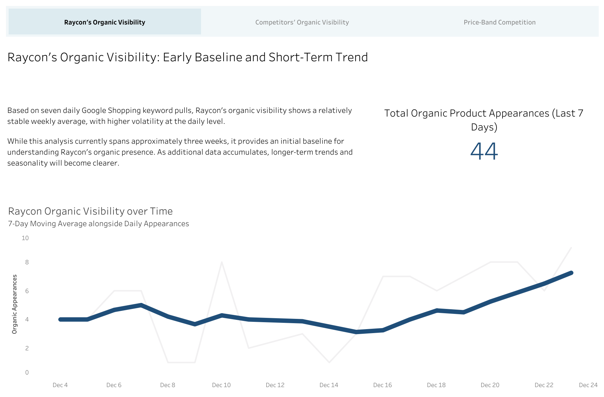
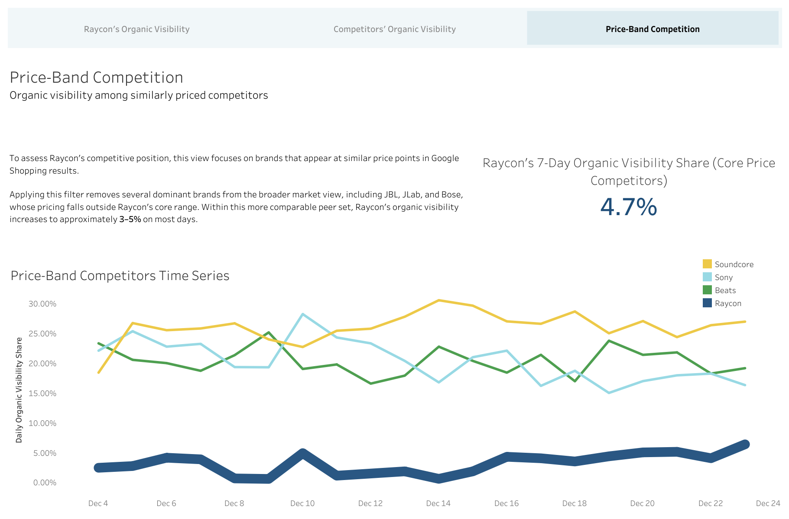

# Raycon Competitive Intelligence: Google Shopping Visibility & Pricing Analytics

Tableau Dashboard Suite:
https://public.tableau.com/app/profile/thomas.howell2255/viz/RayconCompetitiveIntelligence-GoogleShoppingOrganicVisibility/RayconsOrganicVisibility
<br> <br>



## 1. Project Scope

**Client Scenario:**
This project is framed as a consulting-style case study focused on Raycon, a direct-to-consumer audio brand. It is not affiliated with or endorsed by Raycon.

**Business Problem:**
Raycon competes in crowded, high-intent keyword categories such as wireless earbuds, noise-cancelling earbuds, and budget headphones. Improving Google Shopping visibility is strategically important.
Raycon lacks clear visibility into:
- How often its products appear in Google Shopping search results
- Its visibility relative to its competitors
- Whether visibility is improving or declining over time

**Objectives:**
- Pull daily Google Shopping results for high-intent audio keywords
- Store, preserve, and transform raw API payloads
- Generate organic visibility metrics
- Communicate insights through a Tableau dashboard suite

**Business Value:**
By understanding visibility patterns and competitor dominance, Raycon can:
- Improve high-margin DTC acquisition
- Benchmark their position against major competitors
- Make data-driven marketing and pricing decisions

## 2. Results Overview
**Source:** SerpAPI (Google Shopping engine)  
**Cadence:** Daily (7 keywords/day)  

### Results & Key Insights



#### Market Visibility Structure
- Six brands account for over half of organic visibility in Google Shopping.
- Raycon’s baseline visibility is meaningfully lower than the leading brands.

#### Raycon Baseline Visibility
- Across the full competitive landscape, Raycon represents approximately ~1% of total organic Google Shopping visibility.
- Daily visibility exhibits noticeable volatility, while the 7-day moving average remains relatively stable over the observed period.

#### Competitive Position Within Core Price Band
- When restricting comparisons to competitors with overlapping mid-range pricing (P20–P80 overlap), several dominant brands drop out of the analysis.
- Within this more comparable peer set, Raycon’s organic visibility increases to approximately 3–5% on most days.
- Soundcore, Sony, and Beats account for roughly 60–70% of total visibility within this price band, indicating continued concentration but a more realistic benchmark for Raycon’s position.

## 3. Dataset Overview
The dataset consists of daily Google Shopping API responses, parsed from nested JSON into structured tables for analysis.

## 4. Pipeline Design & Reliability

The pipeline is designed to support reliable, repeatable analytics over time rather than one-off analysis.

Key design principles:
- **Immutable raw ingestion** to preserve historical state and support reprocessing
- **SQL-first canonical selection** to consistently identify the latest valid records per day
- **Idempotent staging** to allow safe re-runs without data duplication
- **Transactional execution with run-level logging** to prevent partial writes and record execution status, row counts, and runtime

## 5. Pipeline Lifecycle
1. Ingest raw Google Shopping API payloads into raw tables
2. Select canonical daily records via SQL windowing logic
3. Transform and stage structured search and result data
4. Build analytic dimensions and marts
5. Publish dashboards for monitoring and analysis

The pipeline executes on a daily schedule and is designed to safely re-run and catch up if a scheduled execution is missed.

## 5. Project Structure
```
raycon-competitive-intelligence/
│
├── notebooks/        # Exploration, prototyping, and schema design
├── src/              # Production pipeline logic
│   ├── pipeline/     # Ingestion, staging, and orchestration
│   ├── transform/    # Parsing and normalization logic
│   └── db/           # DB logic, schema creation, views, dimensions, and marts
│
├── data/             # Sample data and derived outputs
├── assets/           # Figures used in documentation
├── logs/             # Runtime logs (gitignored)
└── tableau/          # Dashboards and mockups
```
## 6. Reproducibility
The project is reproducible using Python, PostgreSQL, and a SerpAPI key. Dependencies are listed in requirements.txt, and final outputs are published via Tableau Public.

## 7. Conclusion

This project demonstrates an end-to-end competitive intelligence pipeline using real Google Shopping data, from raw ingestion through analytics-ready marts and dashboards. 

The analysis highlights how organic visibility is distributed across competitors and how Raycon’s position changes when evaluated against comparable price-band peers. Together, the pipeline and dashboards provide a foundation for monitoring visibility trends, competitive concentration, and pricing context over time.

## 8. Next Steps
- Expand analytical marts to support pricing and seller-level analysis
- Add data quality checks for anomalous visibility shifts
- Migrate execution to cloud-based orchestration as scale increases
